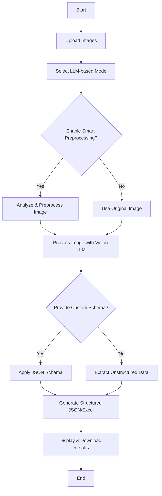
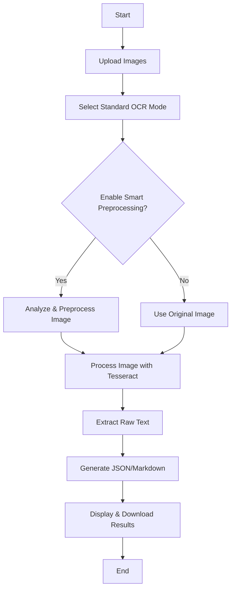
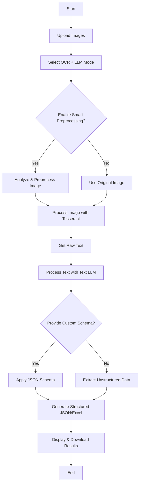

# DocuExtract

[](https://www.python.org/downloads/)
[](https://streamlit.io)
[](https://opensource.org/licenses/MIT)
[](CONTRIBUTING.md)

A powerful, modular Streamlit application for performing Optical Character Recognition (OCR) and structured data extraction from images using local LLMs and traditional OCR engines.

## 🚀 Features

- **Multiple Processing Modes**:
  - **LLM-based**: Direct image processing using vision-capable LLMs (e.g., LLaVA).
  - **Standard OCR**: Traditional text extraction using Tesseract.
  - **OCR + LLM Extraction**: A hybrid approach that uses Tesseract for OCR and an LLM for structured data extraction.
- **Smart Preprocessing**:
  - Automatic image quality analysis and skew correction.
  - Manual override for fine-tuning brightness, contrast, denoising, and more.
- **Flexible Input/Output**:
  - Process single images, multiple images, or entire folders.
  - Supports JPG, PNG, BMP, TIFF, and PDF formats.
  - Export data to JSON, Markdown, or multi-sheet XLSX files.
- **Highly Configurable**:
  - Customize LLM prompts and enforce JSON schemas for structured output.
  - Manage settings via a central `config.yaml` file without code changes.
- **Local First**: Your data and images are processed locally and never sent to the cloud.

## ⚙️ How It Works

The application provides three distinct workflows for processing your documents.

### 1. LLM-based Mode

This mode uses a vision-capable Large Language Model (LLM) to analyze the image and extract data in one step. It's best for complex layouts, handwriting, or when you need structured data directly from an image.



### 2. Standard OCR Mode

This mode uses the Tesseract OCR engine to perform traditional text extraction. It's fast and ideal for converting high-quality scanned documents into plain text.



### 3. OCR + LLM Extraction Mode

This hybrid mode first uses Tesseract to get the raw text from the image and then feeds that text to an LLM for structuring and analysis. It's perfect for extracting structured data (like tables or forms) from scanned documents.



## 📁 Project Structure

```
DocuExtract/
├── app.py                 # Main Streamlit application
├── config.yaml           # Configuration file
├── requirements.txt      # Python dependencies
├── README.md            # This file
└── src/                # Source code modules
    ├── core/           # Core functionality (config management)
    ├── preprocessing/  # Image preprocessing and analysis
    ├── processors/     # OCR and LLM processing engines
    ├── output/         # Output format handlers (JSON, Excel, etc.)
    ├── ui/             # Streamlit UI components
    └── utils/          # Utility functions
```

## 🛠️ System Requirements

1.  **Python 3.8+**
2.  **Tesseract OCR**: Must be installed and in your system's PATH.
    -   **macOS**: `brew install tesseract`
    -   **Ubuntu/Debian**: `sudo apt-get install tesseract-ocr`
3.  **Ollama** (for LLM inference):
    -   Install from [ollama.ai](https://ollama.ai/install.sh).
    -   Pull the required models: `ollama pull llava` and `ollama pull mistral`.
4.  **Poppler** (for PDF support):
    -   **macOS**: `brew install poppler`
    -   **Ubuntu/Debian**: `sudo apt-get install poppler-utils`

## 📦 Installation

1.  **Clone the repository:**
    ```bash
    git clone https://github.com/your-username/simple-ocr-pipeline.git
    cd simple-ocr-pipeline
    ```

2.  **Create and activate a virtual environment:**
    ```bash
    python -m venv venv
    source venv/bin/activate  # On Windows: venv\Scripts\activate
    ```

3.  **Install dependencies:**
    ```bash
    pip install -r requirements.txt
    ```

4.  **Ensure Ollama is running:**
    Open a separate terminal and run `ollama serve`.

## ⚙️ Configuration

The `config.yaml` file allows you to customize the application's behavior.

-   **Models**: Define the LLM models available in the UI.
-   **Preprocessing**: Set default preprocessing parameters and quality thresholds.
-   **Limits**: Adjust the maximum number of images for batch processing.

**Example `config.yaml` snippet:**
```yaml
preprocessing:
  enabled_by_default: true
  auto_detect: true
  quality_thresholds:
    blur_threshold: 100
    contrast_threshold: 40
```

## 🚀 Usage

1.  **Start the application:**
    ```bash
    streamlit run app.py
    ```

2.  **Open your browser** to the local URL provided by Streamlit (usually `http://localhost:8501`).

3.  **Configure your extraction** in the sidebar:
    -   Select the **Processing Mode**.
    -   Choose the **Models/Languages**.
    -   Set the desired **Output Format**.
    -   Configure **Preprocessing** (auto, manual, or disabled).
    -   (Optional) Provide a **Custom Prompt** or **JSON Schema**.

4.  **Provide input**:
    -   Upload images/PDFs directly.
    -   Or, enter a path to a folder containing your files.

5.  Click **"Run Extraction"** and download your results.

## 🐛 Troubleshooting

-   **"Tesseract not found"**: Ensure Tesseract is installed and its executable is in your system's PATH.
-   **"Cannot connect to Ollama"**: Make sure the `ollama serve` command is running in a separate terminal.
-   **Poor OCR Results**: Enable smart preprocessing or manually adjust the settings for better image quality.

## 🔒 Security Note

This application runs entirely on your local machine. Your images and data are never uploaded to any cloud service, ensuring complete privacy.

## 🤝 Contributing

Contributions, issues, and feature requests are welcome! Feel free to check the [issues page](https://github.com/your-username/simple-ocr-pipeline/issues).

## 📄 License

This project is licensed under the MIT License. See the [LICENSE](LICENSE) file for details.
